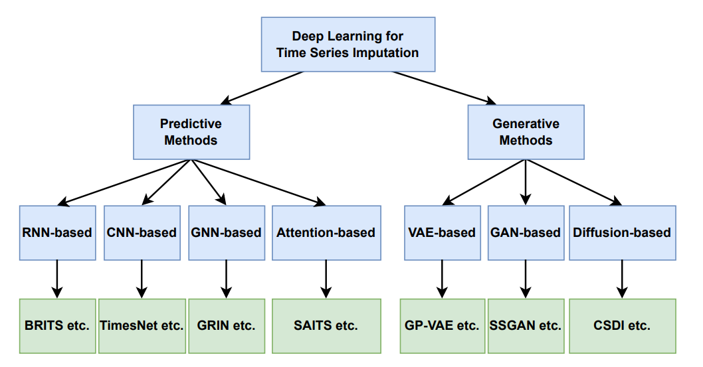
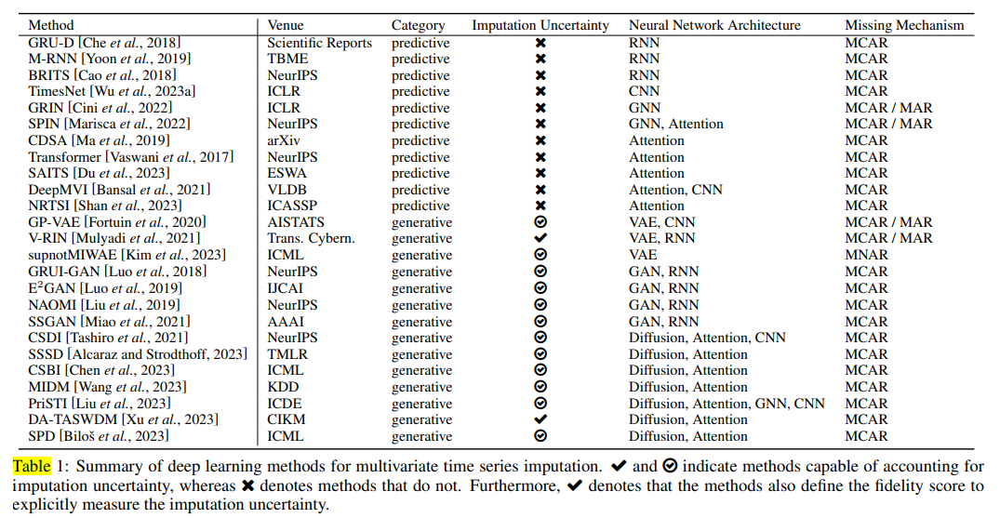
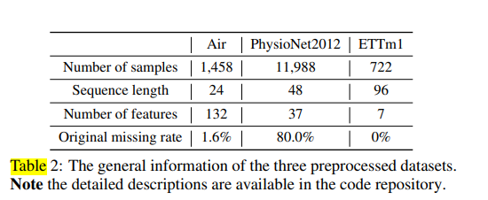
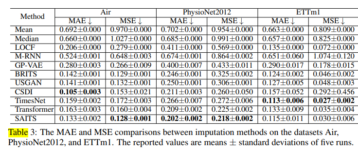
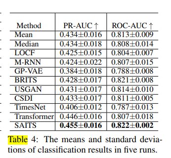
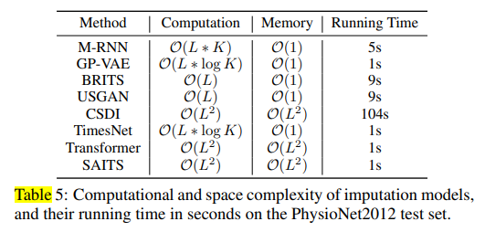

# 深度学习用于多元时间序列插补：一项调查

香港科技大学、PyPOTS研究团队、华为诺亚方舟实验室、Squirrel AI

关键词： 深度学习、缺失值插补、多元时间序列

## 文章评分

作为一篇综述文章，其可参考性主要取决于文献的广度、深度以及分析的深入程度。如果该综述能够全面地概述当前领域的最新进展，并提供对未来研究方向的深刻见解，那么它在创新性和实际应用价值方面可能得分较高。

## Content Highlights

- 提出了一种深度学习插补方法的分类法，根据插补不确定性（预测与生成）和神经网络架构（RNN、CNN、GNN、注意力、VAE、GAN、扩散）对时间序列插补 MTSI 方法进行分类。
- 回顾了各种插补方法，强调了它们的优点和局限性。
- 通过实证实验，比较不同方法的有效性。
- 讨论了多变量时间序列插补的开放问题和未来的研究方向。
- 论文包括对 Temporal belief memory(时间信念记忆)、M-RNN、BRITS 和基于 CNN 的模型（如 TimesNet 和 GP-VAE）的引用。

## Abstract

对应用于多变量时间序列数据插补的深度学习技术进行了全面回顾。对现有方法进行了分类，讨论了其优势和局限性，并指出了未来的研究方向，强调了深度学习对处理不完整时间序列数据的渐进式影响。

讨论了多变量时间序列数据中缺失值的挑战，这损害了时间序列的完整性并阻碍了有效的数据分析;强调了深度学习插补方法在提高损坏的时间序列数据质量和提高下游任务性能方面的成功;提供了最近深度学习插补方法的分类，回顾了它们的优势和局限性，并包括实证实验来比较其有效性。

## Introduction

全面概述了多变量时间序列插补 （MTSI） 领域的挑战和发展，重点介绍了从传统统计和机器学习方法到高级深度学习方法的转变。

### 多变量时间序列数据收集的挑战

- 领域：金融、医药、交通等，在这些领域中，数据收集容易出现传感器故障、环境不稳定和隐私问题等问题。
- 影响：缺失值的普遍性很高，影响了分析和决策的准确性和可靠性。例如，PhysioNet2012 数据集的平均缺失率为 80%。
  
### 历史插补方法

- 统计方法：使用简单的统计量（零、平均值、最后观测值）和 ARIMA、ARFIMA 和 SARIMA 等模型。
- 机器学习技术：包括回归、K 最近邻、矩阵分解，值得注意的实现是 KNNI、TIDER、MICE。这些方法虽然有效，但通常无法捕获时间序列数据中的复杂时间关系和变化。

### 通过深度学习实现进步

- 建模能力：深度学习插补方法利用 Transformers、VAE、GAN 和扩散模型等模型，显示出对时间序列数据的复杂动态建模的显着能力。
- 学习数据分布：这些方法可以从观察到的数据中学习底层数据分布，从而预测缺失组件的更可靠值。

引言部分详细阐述了在金融、医药和交通等各个领域收集多变量时间序列数据的困难和不确定性。强调了缺失值对数据分析的影响以及有效插补方法的必要性。

### 调查和分类

- 现有调查：以前的调查主要集中在统计和机器学习方法上，对深度学习方法的考虑有限。
- 贡献：本文旨在通过对MTSI深度学习方法进行全面调查来填补知识空白，提出一种基于插补不确定性和神经网络架构的新分类法。

### 分类详细信息

- 插补不确定性：将方法分为预测方法（提供固定估计值）和生成方法（提供可能值的分布）。
- 神经网络架构：探索为MTSI量身定制的各种深度学习模型，包括RNN、GNN、CNN、基于注意力的模型、VAE、GAN和基于扩散的模型。

### 实证研究与未来方向

- 进行实证研究以评估插补算法，探索其性能和对下游任务的影响。
- 建议MTSI未来的研究机会，旨在促进该领域的进一步研究。

### 贡献

1. 为深度 MTSI 方法引入了一种新的分类法，结合了插补不确定性和神经网络架构。
2. 使用 PyPOTS 工具包对插补算法进行全面的方法论回顾和实证评估。
3. 重点介绍MTSI未来的研究机会。

为深度学习插补方法的详细探索奠定了基础，为理解MTSI研究的现状和未来前景提供了一个清晰的框架。

**主要内容：**

- 指出缺失值是时间序列数据分析中的常见问题，会影响数据完整性和分析准确性。
- 深度学习方法在缺失值插补方面取得了显著进展，可以提高数据质量并改善后续任务的性能。
- 对近期提出的深度学习插补方法进行了全面的综述，包括分类、优缺点分析，并进行了实验对比。
- 指出了多元时间序列数据缺失值插补领域未来研究的开放问题。
  附有代码和配置等资源。

### MTSI的背景

问题定义:

The section "Preliminary and Taxonomy" delves into the foundational aspects of Multivariate Time Series Imputation (MTSI) and establishes a framework for understanding the various components involved in dealing with incomplete time series data. Here's an analysis:

探讨了多变量时间序列插补 （MTSI） 的基础方面，并建立了一个框架，用于理解处理不完整时间序列数据所涉及的各个组件。分析如下：

#### Problem Definition 问题定义

- **时间序列数据**: 一个周期 [0, T] 上的完整数据集表示为 \(D = \{X_i, t_i\}_{i=1}^N\)，其中 \(X_i \in \mathbb{R}^{K \times L}\) 表示 \(L\) 个时间步长上的 \(K\) 个特征的多元时间序列，\(t_i\) 是相应的时间向量。
- **缺失数据**: 数据集包括观测值(\(X_o\)) 和缺失值 (\(X_m\))，观测矩阵 \(M_i\) 表示每个点的数据的存在 (1) 或不存在 (0)。
- **Time-lag Matrix(时间滞后矩阵) (\(\delta_i\))**: 表示观测之间经过的时间，考虑到数据收集的间隔，这对于理解缺失数据的时间动态至关重要。

#### MTSI插补目标

- 目标是开发一个插补模型 \(M_\theta\)，由 \(\theta\) 参数化，可以准确估计 \(X_o\) 中的缺失值，从而产生一个插补矩阵 \(\hat{X}\)。
- 缺失值处理过程旨在通过插补数据来尽可能接近真实数据 \(X\)，或者通过使用插补后的数据 \(\hat{X}\) 相比原始数据 \(X_o\) 来提高下游任务的性能。

解释:

- 缺失值处理 (imputation): 指的是处理数据集中缺失的部分数据值的过程。
- 真实数据 (X): 指的是完整数据集中的数据值。
- 插补数据 (\hat{X}): 指的是通过某种方法估计出来的缺失值。
- 下游任务: 指的是利用数据进行分析或预测的任务。

#### Missing Mechanism 缺失机制

- 根据鲁宾的理论，数据缺失的原因分为三种类型：完全随机缺失（MCAR）、随机缺失（MAR）和非随机缺失（MNAR）。
  - **MCAR**: MCAR：缺失与任何数据值无关，无论是观察到的还是缺失的。
  - **MAR**: MAR：丢失数据的概率仅取决于观测到的数据。
  - **MNAR**: MNAR：缺失与缺失数据本身有关，也可能与观测到的数据有关。
- 这些机制之间的区别至关重要，因为它会影响插补模型的假设及其在不同情景下的有效性。

### Taxonomy Development 分类法发展

> **图 1：基于插补不确定性和神经网络架构的多元时间序列深度学习插补方法分类。每个类别展示了一个代表性模型。**

**解释:**

- **插补不确定性 (Imputation uncertainty)** 指的是插补值可能与真实值存在差异的程度，是衡量插补方法可靠性的一项重要指标。
- **神经网络架构 (Neural network architecture)** 指的是神经网络的结构设计，不同的架构会影响模型的学习能力和性能。
- **多元时间序列 (Multivariate time series)** 指的是包含多个变量的时间序列数据，每个变量都随时间变化。
- **分类 (Taxonomy)** 指的是对事物进行分类和分组的一种方法，本图将深度学习插补方法根据插补不确定性和神经网络架构进行分类。
- **代表性模型 (Representative model)** 指的是每个分类中选择的一个模型作为示例。

本节为 MTSI 方法的详细分类奠定了基础，这些方法将根据插补不确定性（反映插补值的置信度）和所使用的神经网络架构类型（例如，RNN、GNN、CNN、基于注意力、VAE、GAN、基于扩散）进行分类。

该分类旨在全面概述MTSI方法的前景，指导研究人员和从业人员根据其时间序列数据的具体特征和他们遇到的缺失的性质选择适当的模型。

这种基础设置对于后续讨论各种插补方法、它们的应用以及它们在处理多变量时间序列数据带来的复杂挑战方面的有效性至关重要。

用于多变量时间序列插补的深度学习方法的分类法围绕两种主要类型的方法构建：预测和生成。

这种分类基于该方法处理插补不确定性的能力及其底层神经网络架构。以下是对所提供信息的深入了解：

#### 插补方法的分类

预测方法为缺失值提供固定估计，而不考虑插补过程中固有的不确定性。它们通常是确定性的，并为每个缺失的条目提供单个插补值。

生成方法

生成方法产生可能的插补值的分布，承认过程中固有的不确定性。

这些方法是概率性的，可以为缺失的数据点生成多个合理的值，从而提供插补不确定性的度量。

神经网络架构

- 基于 RNN 的方法：由于它们能够对时间依赖关系进行建模（例如，GRU-D、M-RNN、BRITS），因此对时间序列数据很有用。
- 基于 CNN 的方法：利用空间层次结构，可以有效地处理具有空间关系的数据，例如多变量时间序列（例如 TimesNet）。
- 基于GNN的方法：图神经网络擅长捕获非欧几里得结构化数据（例如GRIN，SPIN）中的依赖关系。
- 基于注意力的方法：提供一种机制来权衡输入数据不同部分的重要性，这对于具有不规则模式的时间序列（例如，Transformer、SAITS）特别有用。
- 基于VAE的方法：变分自动编码器可以对数据的分布进行建模，为生成新样本（例如GP-VAE）提供原则性方法。
- 基于GAN的方法：生成对抗网络以其生成高质量数据样本的能力而闻名（例如，GRUI-GAN，E^2GAN）。
- 基于扩散的方法：这些方法将数据生成过程建模为扩散过程，可以反转以从噪声（例如，CSDI、PriSTI）生成数据。

表 1：方法摘要

表 1 总结了用于多变量时间序列插补的各种深度学习方法，这些方法根据其插补不确定性能力、神经网络架构以及它们所解决的缺失机制进行分类。

文中提供的表格总结了各种深度学习方法，按其插补不确定性能力（用 Ì 表示为考虑不确定性的方法，用 é 表示不考虑不确定性的方法）以及该方法是否定义了保真度分数来明确测量插补不确定性（用 Ë 表示）。

缺少机制

该表还指定了每个方法旨在处理的缺失数据机制：

- MCAR：完全随机缺失，其中缺失的概率与数据无关。
- MAR：随机缺失，其中缺失取决于观察到的数据。
- MNAR：非随机缺失，其中缺失与缺失值本身有关。

该分类法提供了一种结构化方法，用于理解和选择时间序列插补任务的适当深度学习模型。它强调了将插补方法与数据集中缺失数据机制的性质相匹配的重要性，以达到最佳的插补结果。

##### 表一详细分析

> 该表提供了用于多变量时间序列插补的各种深度学习方法的综合视图，重点介绍了它们的功能和特征：

1. 插补不确定性 **Imputation Uncertainty**
   - ✔️: 可以解释插补不确定性的方法。
   - 🌐: 既考虑不确定性又提供保真度分数的方法，对插补值中的不确定性进行定量测量。
   - ✖️: 不考虑插补不确定性的方法。

2. **Neural Network Architecture**: 
   - RNN (Recurrent Neural Network)
   - CNN (Convolutional Neural Network)
   - GNN (Graph Neural Network)
   - Attention mechanisms
   - VAE (Variational AutoEncoder) VAE（变分自动编码器）
   - GAN (Generative Adversarial Network)
   - Combinations of these (e.g., VAE, RNN) 这些的组合（例如，VAE、RNN）

3. **Category**: 类别
   - Predictive: Methods that predict a single value for each missing entry.预测：预测每个缺失条目的单个值的方法。
   - Generative: Methods that can generate a distribution of possible values for the missing entries.生成式：可以为缺失条目生成可能值分布的方法。

4. **Missing Mechanism**: This column specifies which type of missing data the method is designed to address:缺失机制：此列指定该方法旨在解决的缺失数据类型：
   - MCAR (Missing Completely At Random) MCAR（完全随机缺失）
   - MAR (Missing At Random)（随机缺失）
   - MNAR (Missing Not At Random) MNAR（非随机缺失）

从这张表中可以看出，虽然许多方法都专注于 MCAR 数据，但也有一些方法专为更复杂的 MAR 和 MNAR 场景而设计，这反映了人们越来越认识到需要处理现实世界的数据缺失。这些方法在架构上是多种多样的，显示了深度学习领域内应对时间序列插补挑战的方法的广度。包含明确测量插补不确定性的方法表明了解决问题的细致入微的方法，承认在许多现实世界的场景中，并不总是有一个“正确”的值可以插补。

### 多变量时间序列的预测插补方法

介绍了多变量时间序列的预测插补方法。它根据所采用的神经网络架构将这些方法分为四种主要类型：基于 RNN、基于 CNN、基于 GNN 和基于注意力的模型。以下是该部分的细分：

#### 学习目标

- 预测插补方法是确定性的，在不考虑不确定性的情况下为缺失数据提供固定估计。
- 它们通常使用损失函数\(L_{det}(\theta)\)来最小化预测值和实际观测值之间的误差（绝对值或平方值）。

#### 基于RNN的模型

- GRU-D：引入一种衰减机制，以考虑自上次观测以来的时间，对具有缺失值的时间序列进行建模。
- Temporal Belief 时间信念记忆：使用双向 RNN 来计算每个特征的最后一次观测的信念，并相应地插补缺失值。
- M-RNN 和 BRITS：这些模型包含时间衰减函数来处理缺失，还可以执行时间序列分类。
- 后续工作：将 RNN 与 GAN 相结合，以产生更准确的插补。

#### 基于CNN的模型

- TimesNet：使用快速傅里叶变换将 1D 时间序列重构为 2D，从而促进 CNN 的使用。
- GP-VAE：采用 CNN 作为编码器和解码器阶段的主干。
- 注意力和扩散模型中的 CNN：在 DeepMVI 和 CSDI 等模型中充当特征提取器。

#### 基于GNN的模型

- GRIN：MTSI的第一个基于图的递归架构，利用了空间相似性和时间动态。
- SPIN：在 GNN 框架中集成时空注意力，解决 GRIN 中的问题并增强鲁棒性。

#### 基于注意力的模型

- 注意力机制，特别是在引入 Transformer 之后，在时间序列数据建模方面已经变得很普遍。
- CDSA、DeepMVI、NRTSI和SAITS等模型利用不同程度的注意力进行插补，利用长期和局部嵌入。

#### 优点和缺点

- RNN：擅长捕获序列信息，但可能会面临长序列的可扩展性问题。
- CNN：在特征提取方面表现出色，但在用作时间序列数据的主要架构时可能会有局限性。
- 基于注意力的模型：擅长处理长程依赖关系并提供并行处理，在插补任务中通常优于 RNN 和 CNN 方法。
- GNN：提供对时空动力学的见解，但计算可能很复杂，因此对于大规模或高维数据具有挑战性。

### 多变量时间序列的生成插补方法

这些方法的特点是通过概率建模处理插补中的不确定性。以下是该部分的细分：

#### 生成插补学习目标

生成方法从观察到的数据中学习，以生成反映基础数据分布的各种输出，从而可以量化插补不确定性。

#### 基于VAE的模型

- VAE：利用编码器-解码器结构对数据分布进行建模，旨在最大化证据下限 （ELBO）。
- GP-VAE：引入高斯过程，用于捕获时间动态。
- V-RIN：通过对输出的高斯分布进行建模来解释不确定性。
- supnotMIWAE：扩展 ELBO，对观测数据、其掩码和标签的联合分布进行建模，从而增强下游任务性能。

#### 基于GAN的模型

- GAN：在生成器和鉴别器之间采用对抗性训练来逐步优化合成数据。
- GRUI-GAN：一种两阶段GAN方法，用于学习数据分布，然后优化输入噪声以获得更好的相似性。
- E2GAN：通过使用去噪自动编码器来避免噪声优化阶段。
- NAOMI：一种非自回归多分辨率 GAN 模型，以分层方式生成数据以减少错误累积。
- USGAN 和 SSGAN：通过集成具有额外复杂性的判别器来提高插补质量，并利用标签信息进行半监督学习。

#### 基于扩散的模型

- 扩散模型：通过可逆马尔可夫链过程捕获复杂的数据分布，该过程逐渐添加和消除噪声。
- CSDI：采用条件训练方法生成数据，使用观测数据的子集作为条件信息。
- SSSD：通过整合结构化状态空间模型来解决计算问题。
- CSBI：通过随机微分方程对扩散过程进行建模，从而提高效率。

#### 生成方法优点和缺点

- VAE模型：提供坚实的理论基础，但在生成复杂的数据变化方面可能受到限制。
- GAN模型：能够生成高质量的插补，但训练具有挑战性，并且可能受到训练不稳定的影响。
- 扩散模型：擅长捕获详细的数据模式，但计算量大，并且可能存在缺失数据和观测数据之间的边界一致性问题。

### 时间序列插补的各种工具包和库

讨论了可用于时间序列插补的各种工具包和库，从简单的方法到复杂的深度学习方法。以下是详细概述：

#### 5 个时间序列插补工具包

- imputeTS：一个 R 库，提供基本的插补技术，如平均值、上次观测结转、线性插值、卡尔曼平滑和加权移动平均，主要用于单变量时间序列。
- mice：另一个以通过链式方程实现多变量插补而闻名的 R 包，虽然不是专门为时间序列数据设计的，但广泛应用于多变量时间序列插补的统计领域。
- Impyute 和 Autoimpute：这些库提供适用于横截面和时间序列数据的简单插补方法。Impyute 包括移动平均等基本技术，而 Autoimpute 则集成多项式和样条插值等参数化方法。
- GluonTS：用于时间序列的生成式机器学习包，提供基本的插补方法，包括虚拟值和随意均值插补。
- Sktime：一个为单变量时间序列数据提供机器学习插补算法的库，使用户能够拟合和预测缺失值。

解释:
插补（Imputation）：指处理数据集中缺失值的技术。
横截面数据（Cross-sectional data）：指在特定时间点收集的数据。
时间序列数据（Time-series data）：指按时间顺序收集的数据。
简单插补方法（Naive imputation methods）：指基于数据自身简单统计特征的插补方法。
Impyute：一个 Python 库，提供各种基本的插补方法，例如移动平均、最近邻插值等。
Autoimpute：另一个 Python 库，提供基于参数化的插补方法，例如多项式插值、样条插值等。

深度学习插补

- PyPOTS：用于对部分观测到的时间序列数据进行建模的专用工具箱。它采用端到端方法，包括十几个深度学习神经网络，用于不完整时间序列的任务，迄今为止开发了八个插补模型。

这些工具包有助于完成各种插补任务，并提供一系列适用于不同类型的时间序列数据和缺失模式的方法。

本节强调了从基本到高级的可用资源的广度，以处理时间序列中缺失值的插补，强调了时间序列分析领域工具的演变和多样性。

### 实证研究

介绍了用于多变量时间序列插补的各种深度学习方法的实验评估，并对其性能进行了严格的比较。以下是该部分的细分：

实验装置

- 硬件：实验在配备 AMD EPYC 7543 32 核 CPU 和 NVIDIA GeForce RTX 4090 GPU 的机器上进行。
- 代码可用性：所有相关代码（包括预处理、配置和训练脚本）都可以在 GitHub 上获得，网址为[github](<https://github.com/WenjieDu/Awesome Imputation>) 。

#### 数据集和插补方法

数据集：三个真实世界的数据集用于测试：

- 空气：包含 1,458 个样本，序列长度为 24 个和 132 个特征，原始缺失率为 1.6%。
- PhysioNet2012：包含11,988个样本，序列长度为48个和37个特征，缺失率高达80%。
- ETTm1：包括 722 个样本，序列长度为 96 个，特征为 7 个，最初没有任何缺失值。

插补方法：该研究比较了三种朴素方法（均值、中位数和 LOCF）和八种深度学习模型：

- M-RNN：用于插补的 RNN 变体。
- GP-VAE：在VAE框架内利用高斯过程。
- BRITS：一种基于RNN的双向插补模型。
- USGAN：一种专注于单变量时间序列的 GAN 模型。
- CSDI：一种专为时间序列插补而设计的扩散模型。
- TimesNet：采用 CNN，专为时间序列数据量身定制。
- Transformer：使用自注意力机制进行插补。
- SAITS：一种基于注意力的自监督学习模型。

工具箱：PyPOTS 用于实验，提供对插补方法的即时访问。超参数经过优化，可确保所有方法的公平性。

表 2：数据集详细信息

该表概述了数据集，包括样本数、序列长度、特征数和原始缺失率。

#### 实验结果

对不同深度学习插补方法进行实证评估的结果和分析。以下是调查结果的详细介绍：

插补精度评估

- 使用的指标：报告了三个数据集中 12 种方法的平均绝对误差 （MAE） 和均方误差 （MSE）。
- 研究结果：在所有数据集中，没有一种方法优于其他方法。值得注意的是，LOCF 在 Air 和 ETTm1 等低缺失率数据集上表现良好，而深度学习方法在缺失率高的 PhysioNet2012 数据集上表现出色。
  
下游任务评估

- 方法：该研究使用简单的 LSTM 模型对 PhysioNet2012 数据集进行二元分类，评估插补数据质量对下游任务的影响。
- 使用的指标：由于类别不平衡，选择了 PR-AUC（精确召回曲线下面积）和 ROC-AUC（受试者工作特征曲线下面积）。
- 结果：分类器受益于更好的插补，SAITS提供了最显着的改进。

复杂性分析

- 计算和空间复杂度：总结每种方法的复杂度，指出所需的资源和运行时间。
- 推理时间：提供每个模型在 PhysioNet2012 测试集上花费的实际时间进行比较。

表3和表4：插补和分类结果

- 表 3：比较各种插补方法的 MAE 和 MSE，显示了跨数据集的性能分布。

- 表 4：根据 PR-AUC 和 ROC-AUC 显示分类性能，突出了对下游任务进行更好插补的好处。

表 5：复杂性和运行时间

- 列出深度学习插补模型的计算和空间复杂度，以及 PhysioNet2012 测试集上的运行时间。

本节强调了根据数据集的特征和预期用例选择正确的插补方法的重要性。深度学习方法，特别是在处理高度缺失或复杂的数据时，被证明在捕获基础数据分布方面具有优越性，从而提高了后续分析或预测模型的性能。

### 未来研究

- 本文系统地回顾了MTSI的深度学习模型，并提出了一种新的分类法来对方法进行分类，并提供了全面的介绍和实验比较。
- 缺失模式：人们呼吁开发能够处理非随机缺失 （MNAR） 数据的插补算法，这在物联网、临床研究和气象学等领域很常见。有效解决MNAR至关重要，因为它会导致观测数据和真实数据之间的分布变化。
- 下游性能：插补的最终目标是改进下游任务。当前的方法遵循“插补和预测”范式，但“编码和预测”端到端方法可能更有利，特别是当缺失的模式包含对下游任务有用的信息时。
- 可扩展性：随着数据量的增长，特别是随着来自通信和物联网设备的数据涌入，深度学习插补模型的计算成本成为一个重大挑战。需要利用并行和分布式计算技术的可扩展解决方案来有效地处理大规模数据集。

本文强调了MTSI的重要性，它不仅是一项独立的任务，而且是一个关键的预处理步骤，可以显著影响下游分析的结果。未来在开发可扩展、高效和 MNAR 感知的插补方法方面的研究对于推动该领域的发展和确保深度学习模型能够在不断增长的时间序列数据领域继续提供价值至关重要。

## 研究帮助

**方法参考：**论文中介绍了多种深度学习插补方法，可以为您的研究提供思路和借鉴。您可以根据您的研究需求选择合适的方法，或者结合不同的方法进行改进。
**理论基础：**论文介绍了缺失值插补的相关理论知识，可以帮助您更好地理解问题。您可以学习论文中提到的评估指标，用于评价您的方法的性能。
**实验设计：**论文提供了实验结果，可以为您的实验设计提供参考。您可以参考论文的实验设置，并进行拓展，例如使用更多的数据集和评价指标。

### 具体内容

深度学习插补方法的分类: 将深度学习插补方法分为三大类：基于回归的方法、基于生成模型的方法和基于混合模型的方法。根据数据特点和研究需求选择合适的方法。
深度学习插补方法的优缺点比较: 对每种方法的优缺点进行了比较。
深度学习插补方法的应用案例: 一些深度学习插补方法的应用案例，了解这些方法在实际应用中的效果。

### 未来研究

- 更有效的深度学习插补方法
- 利用时间序列数据的依赖关系
- 将深度学习插补方法应用于其他领域

### 结合测井领域

#### 数据增强

- 测井数据具有时间序列和空间分布特征。可以利用数据增强技术，例如序列平移、旋转和噪声添加，生成更多训练数据，提高模型的鲁棒性。
- 利用测井曲线之间的关系，例如电阻率和伽马射线之间的关系，进行数据增强。

#### 多任务学习

- 将缺失值插补与其他测井解释任务，例如岩性识别和储层评价，进行联合训练，提高模型的泛化能力。

#### 模型解释

- 利用深度学习模型解释技术，例如 SHAP 值，来解释模型的预测结果，提高模型的可解释性。

#### 测井数据融合

可以融合不同类型的测井数据，例如地震数据和岩心数据，进行缺失值插补，提高插补精度。

#### 领域自适应

由于不同测井井的数据分布差异较大，可以利用领域自适应技术，提高模型在不同测井井上的泛化能力。

#### 以下是一些具体的实验设计建议

使用不同的深度学习模型，例如变分自编码器 (VAE) 或生成对抗网络 (GAN)，进行缺失值插补。
研究如何利用测井日志数据的其他信息，例如地质解释和测井曲线之间的关系，来提高插补精度。
将您的方法应用于其他类型的测井数据，例如地震数据或岩心数据。

### 实验难度

1. 创新点子的复杂性

复杂度越高的创新点子，需要的技术基础和研究经验越多，实验设计难度也就越大。
2. 数据的可用性

如果需要的数据难以获取或处理，实验设计难度就会增加。
3. 计算资源的限制

一些复杂的实验需要大量的计算资源，如果计算资源不足，实验设计难度就会增加。
4. 研究人员的经验和能力

研究人员的经验和能力越强，实验设计难度就越小。

一些降低实验设计难度的建议：

从简单的创新点子开始，逐步进行尝试。
充分利用现有的开源代码和工具。
与其他研究人员合作，共同进行研究。

以下是一些具体的实验设计建议：

多模态数据融合，简单的模态融合，例如电磁和声学模态的融合。
时空联合建模，先从一维时间序列建模开始，再扩展到二维时空建模。
主动学习，简单的主动学习策略开始，例如随机采样策略。
强化学习，简单的奖励函数开始，例如均方误差奖励函数。
可解释性，简单的解释方法开始，例如 SHAP 值解释方法。
